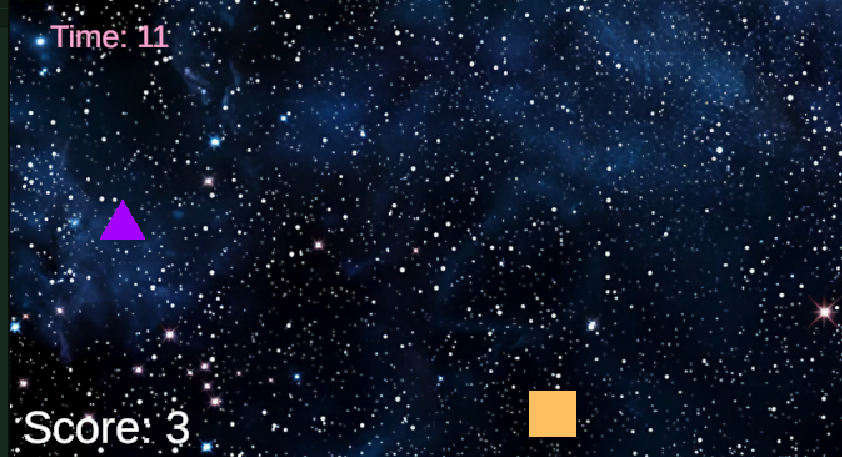

ゲーム制作技術総合実習 個人ワーク
（Circle, Triangle, Squareを使用した2Dゲーム）

# Circle Ball and Triangle Bomb

## ゲームの内容
プレイヤー（四角）を操作して落ちてくるボールをキャッチするスコアアタックゲーム。三角を誤ってとってしまうとスコアが0に戻ってしまうので注意が必要。

## 操作説明
例
- 矢印キー左右で四角を動かせます。操作はそれだけです。
